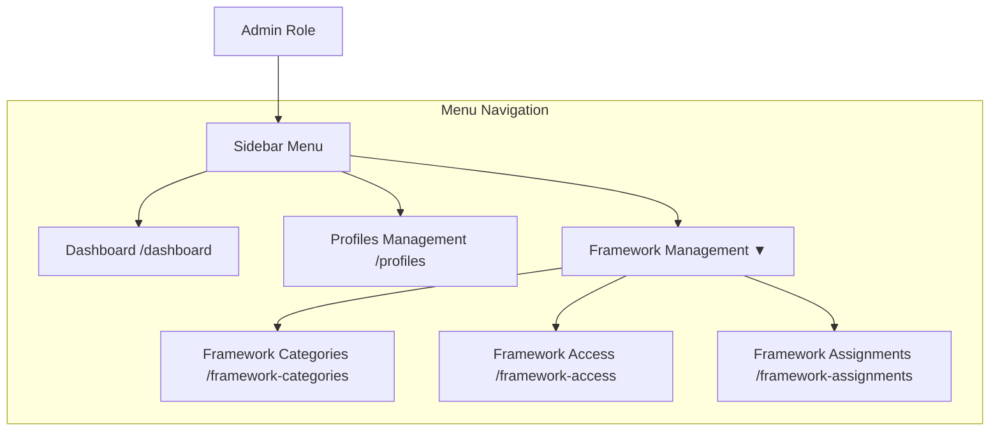
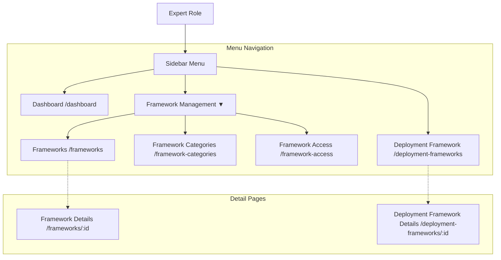
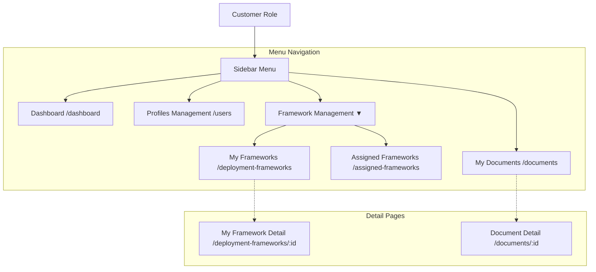
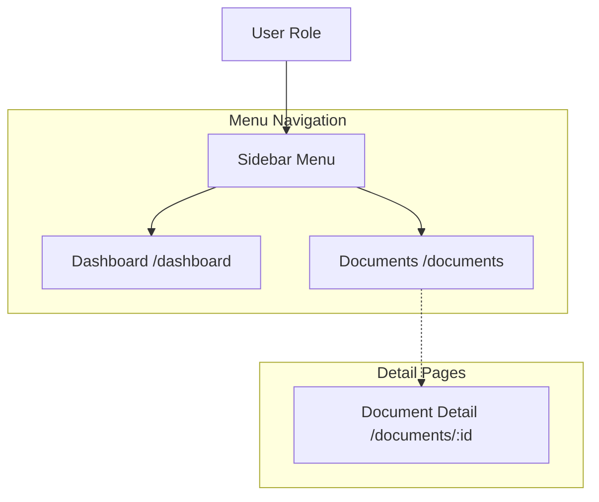

# VORA Navigation and Routing Flow

Below are comprehensive flow diagrams representing the navigation structure and available pages for your application, mapped out according to the authentication state and user roles (`admin`, `expert`, `Customer`, `user`).

## 1. High-Level Routing & Auth Flow

This diagram illustrates the entry point of the app where the system decides what routes the user can access based on their authentication status and assigned role.

```mermaid
graph TD
    %% Base entry point
    Root((Root /)) --> AuthCondition{Is Authenticated?}
    AuthCondition -->|No| Auth[Auth Flow]
    AuthCondition -->|Yes| RoleCheck{User Role?}

    %% Auth Flow Routes
    subgraph Auth Routes
        Auth --> Login[/auth/login]
        Auth --> Register[/auth/register]
        Auth --> ForgotPwd[/auth/forgot-password]
        Auth --> ResetPwd[/auth/reset-password]
        Auth --> VerifyEmail[/auth/verify-email]
        Auth --> VerifyOTP[/auth/verify-otp]
    end

    %% Protected Routes Distribution
    RoleCheck -->|Admin| Admin[Admin Layout]
    RoleCheck -->|Expert| Expert[Expert Layout]
    RoleCheck -->|Customer| Customer[Customer Layout]
    RoleCheck -->|User| AppUser[User Layout]

    %% Shared Routes
    RoleCheck -.-> Profile[Profile View /profile]
```

---

## 2. Admin Navigation Flow

Admins have access to system-wide framework management, profiles management, and an admin dashboard.



---

## 3. Expert Navigation Flow

Experts have access to framework details, deployment frameworks requests, and their own dashboard.



---

## 4. Customer Navigation Flow

Customer users can manage their own nested users, oversee framework deployments assigned to them, and manage deployment documents.



---

## 5. End User Navigation Flow

Standard users have access to a simplified dashboard and their documents view.


