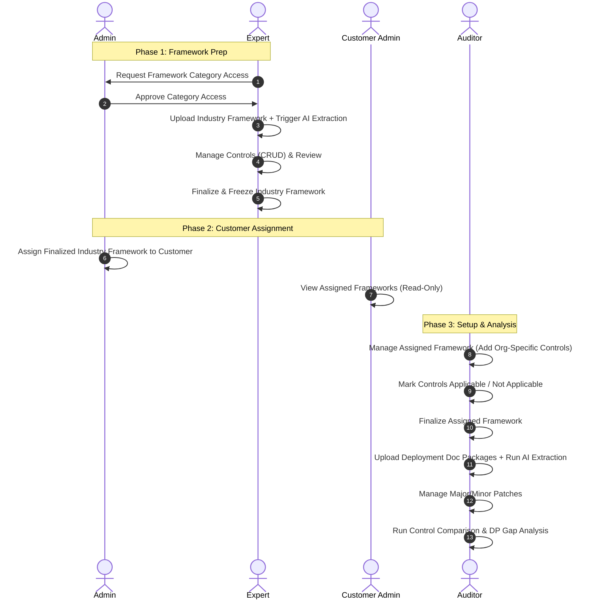

# VORA Frontend Role & Workflow Report

This report defines the system roles, access privileges, and the current compliance workflow of the VORA platform based on the current implementation.

---

## 1. Compliance & Audit Workflow Sequence

The system operates in a sequential flow across roles to upload, assign, configure, and analyze compliance frameworks:

---

## 2. Role and Functionality Matrix

The following matrix maps each role to its exact capabilities in the system:

| Role                | Key Capabilities & Functionalities                                                                                                                                                                                                                                                                                                                                                                                                                                                                                                                                                                                                                                                                     |
| :------------------ | :----------------------------------------------------------------------------------------------------------------------------------------------------------------------------------------------------------------------------------------------------------------------------------------------------------------------------------------------------------------------------------------------------------------------------------------------------------------------------------------------------------------------------------------------------------------------------------------------------------------------------------------------------------------------------------------------------- |
| **System Admin**    | • **User & Customer Management:** Onboard users and organizations. • **Framework Category Management:** CRUD operations on categories. • **Category Access Controls:** Approve, reject, or revoke framework category access for experts. • **Framework Assignment:** Assign finalized industry frameworks to customers; revoke assignments.                                                                                                                                                                                                                                                                                                                                                   |
| **Expert**          | • **Access Request:** Request access to specific framework categories. • **Industry Framework Upload:** Upload new industry frameworks. • **AI Extraction:** Execute AI extraction on uploaded frameworks. • **Control CRUD:** Create, read, update, and delete controls on industry frameworks. • **Finalization:** Review, finalize, and freeze industry frameworks.                                                                                                                                                                                                                                                                                                                     |
| **Customer Admin**  | • **Read-Only View:** View assigned frameworks belonging only to their customer organization.                                                                                                                                                                                                                                                                                                                                                                                                                                                                                                                                                                                                          |
| **Auditor**         | • **Assigned Framework Management:** Manage, review, and finalize assigned frameworks. • **Organization Customization:** Add organization-specific controls to the assigned framework. • **Applicability Controls:** Mark controls as applicable or not applicable. • **Deployment Management:** Upload deployment framework document packages. • **Patch Management:** Perform minor patches (carry documents forward) or major patches (clean slate) on packages. • **Document AI Extraction:** Run AI extraction on uploaded document packages. • **Analysis Execution:** Run comparison of controls and gap analysis of deployment points (DPs) against the finalized framework. |
| **User**            | • (Member of the Customer organization with basic access as defined by customer scope).                                                                                                                                                                                                                                                                                                                                                                                                                                                                                                                                                                                                                |
| **Internal Expert** | • (Customer organization role aligned with audit/review operations).                                                                                                                                                                                                                                                                                                                                                                                                                                                                                                                                                                                                                                   |
